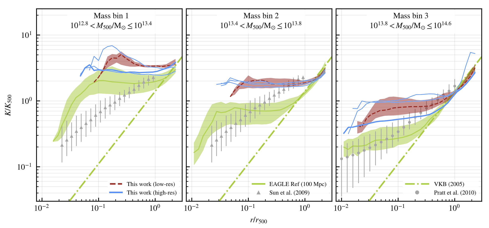

# Entropy core problem


## Data products from the study by [Altamura et al. (2022)](https://ui.adsabs.harvard.edu/abs/2022arXiv221009978A/abstract)



The data are supplied in `hdf5` format. They can be inspectes with `h5dump`, `HDFView` and can be read programmatically using the supplied file `load_data.py`.

`load_data.py` organises the data in categories through the following classes:
- `RefModelExtendedSample`
- `PropertiesReducedSample`
- `ProfilesReducedSample`

For each class, the data structure is the same as in the `hdf5` files and can be navigated using class attributes. The datasets already include the units from the `unyt` module.

This is an example code to plot the profile for the group (`VR2915`) at high resolution (`+1res` in the `hdf5` file or `plus_1res` in the class instance attributes), run with the reference EAGLE-like model (`Ref`).
```python
from load_data import ProfilesReducedSample

profiles = ProfilesReducedSample()
entropy_profile = profiles.data.VR2915_plus_1res.Ref.entropy_profile

# The entropy profile is in dimensionless units, normalised to the self-similar scaling $K_{500}$ 
print(entropy_profile)

# The radial distance of the shells used to bin the particles is scaled by $r_{500}$
radial_bin_centres = profiles.data.VR2915_plus_1res.Ref.radial_bin_centres

from matplotlib import pyplot as plt

# To display the dimensionless profile, use matplotlib
plt.plot(radial_bin_centres, entropy_profile)
plt.xlabel(r"$r/r_{500}$")
plt.ylabel(r"$K/K_{500}$")
plt.show()
```

## Data structure: `RefModelExtendedSample`
```text
RefModelExtendedSample()
|
|-- resolution_minus_8res
|    |-- entropy_profile
|    |-- gas_fraction
|    |-- m500
|    |-- radial_bin_centres
|    |-- star_fraction
|    |-- VR_numbers
|
|-- resolution_plus_1res
     |--  ...
```

## Data structure: `PropertiesReducedSample`
```text
PropertiesReducedSample()
|
|-- redshift_0
|    |-- VR18_minus_1res
|    |    |-- AGNdT8
|    |    |    |-- entropy_core
|    |    |    |-- fbary            {Baryon fraction == fgas + fstar}
|    |    |    |-- fgas
|    |    |    |-- fstar
|    |    |    |-- m500
|    |    |    |-- mbh              {Mass of the SMBH}
|    |    |    |-- mgas             {Mass of the hot gas inside r500}
|    |    |    |-- mstar_100kpc     {Stellar mass of the BCG}
|    |    |    |-- ssfr_100kpc      {1Gyr-averaged specific star-formation rate in the BCG}
|    |    |
|    |    |-- AGNdT9 [same fields]
|    |    |-- Bipolar [...]
|    |    |-- Isotropic [...]
|    |    |-- Random [...]
|    |    |-- Ref [...]
|    |    |-- alpha0 [...]
|    |    |-- noAGN [...]
|    |    |-- noMetalCooling [...]
|    |    |-- noSN [...]
|    |
|    |-- VR18_plus_8res
|    |    |--  ...
|    |
|    |-- VR2915_plus_1res
|    |    |--  ...
|    |
|    |-- VR2915_minus_8res
|         |--  ...
|
|
|-- redshift_1
     |--  ...
```

## Data structure: `ProfilesReducedSample`
```text
ProfilesReducedSample()
|
|-- VR18_minus_1res
|    |-- AGNdT8
|    |    |-- density_profile
|    |    |-- entropy_profile
|    |    |-- temperature_profile
|    |    |-- radial_bin_centers
|    |
|    |-- AGNdT9 [same fields]
|    |-- Bipolar [...]
|    |-- Isotropic [...]
|    |-- Random [...]
|    |-- Ref [...]
|    |-- alpha0 [...]
|    |-- noAGN [...]
|    |-- noMetalCooling [...]
|    |-- noSN [...]
|
|-- VR18_plus_8res
|    |--  ...
|
|-- VR2915_plus_1res
|    |--  ...
|
|-- VR2915_minus_8res
     |--  ...
```
